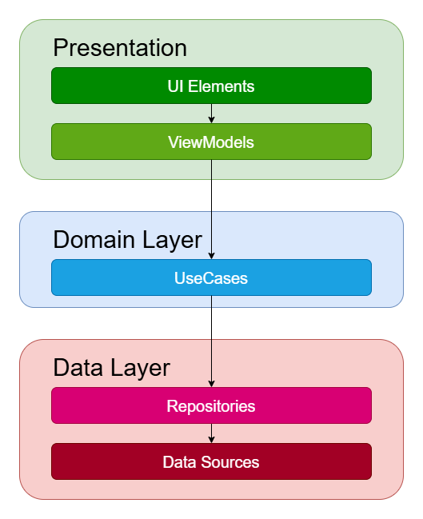
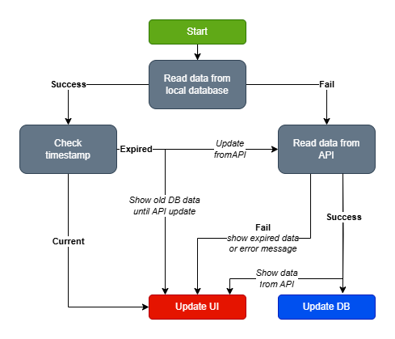

# NBA App - Showcase of Clean Architecture and Modern Android Skills

This application is a demonstration of my skills in developing modern Android applications, with an emphasis on clean architecture, testing, and the use of the latest technologies. The application displays information about players and teams from the NBA league. 

It is also sandbox where I can try new things and experiment with new technologies.

## Key Features

*   **Player List View:** Users can browse a paged list of NBA players from the API..
*   **Player Detail:** Display detailed information about a specific player. Either from the API or from the local database if the record is not older than 24 hours.
*   **Team Detail:** Display detailed information about a specific team.

## Technologies and Libraries Used

*   **Kotlin:** The main programming language.
*   **Jetpack Compose:** A modern UI toolkit for declarative UI development.
*   **Clean Architecture:** Layer separation for better code organization and testability.
*   **Hilt:** Dependency injection framework to simplify dependency management.
*   **Coroutines:** For asynchronous operations and thread management.
*   **Flow:** For reactive programming and working with data streams.
*   **Room:** For local database storage. Cashing player details for 24 hours.
*   **Realm** For local database storage. Favorite players.
*   **Retrofit:** For network communication with the API.
*   **OkHttp:** For efficient HTTP requests.
*   **Coil:** For image loading and caching.
*   **Splash screen API:** For splash screen.
*   **Dependency analysis gradle plugin** Detects unused and misused dependencies
*   **Mockito:** For unit testing.
*   **JUnit:** Testing framework.

## Architecture

The application is designed with an emphasis on **Clean Architecture** principles, which ensures:

*   **Separation of Concerns:** Each layer has a clearly defined responsibility.
*   **Testability:** Each layer is easily testable.
*   **Maintainability:** The code is easily extensible and modifiable.
*   **Framework Independence:** The domain layer is independent of the Android framework.

### Modules

*   **`app`:** The application module that contains navigation and launches the application.
*   **`presentation`:** The module for data presentation and UI logic (ViewModels, UI states).
*   **`domain`:** The module with business logic (Use Cases, Entities).
*   **`data-api`:** The module for API data handling (Repositories, Data Sources).
*   **`data-room`:** The module for Room database data handling (Repositories, Data Sources).
*   **`data-realm`:** The module for Realm database data handling (Repositories, Data Sources).
*   **`core-ui`:** The module for shared UI theme.

### General diagram

Inspired by [Google's Guide to App Architecture](https://developer.android.com/topic/architecture).

## Offline-First Data Flow

The diagram below illustrates the **offline-first** approach used in the application. The system prioritizes loading data from the local database and only fetches data from the API if necessary.

### Data Flow Diagram

### Flow Explanation

1. **Start:** The process begins with an attempt to read data from the local database.
2. **Local Database Read:**
    - If successful, the system checks the **timestamp** to determine if the data is still valid.
    - If the read fails, the system proceeds to fetch data from the API.
3. **Timestamp Check:**
    - If the data is **current**, it is displayed in the UI.
    - If the data is **expired**, an API request is triggered while still showing the old database data until fresh data is available.
4. **API Fetch:**
    - If the API call is **successful**, the new data updates both the UI and the database.
    - If the API call **fails**, the system either shows the expired data (if available) or displays an error message.

This approach ensures that users always see **some data**, even if they are offline or the API fails, improving **app resilience and user experience**. 

Inspired by [Google's Guide to App Architecture](https://developer.android.com/topic/architecture/data-layer/offline-first).

## Why is the Application Built This Way?

*   **Clean Architecture:** Using Clean Architecture allows for the separation of business logic from the UI and framework. This leads to better testability, maintainability, and extensibility of the code.
*   **Jetpack Compose:** Using Jetpack Compose enables declarative UI development, resulting in simpler and more readable code.
*   **Hilt:** Using Hilt simplifies dependency management and reduces the amount of boilerplate code.
*   **Coroutines and Flow:** Using Coroutines and Flow enables efficient work with asynchronous operations and data streams.
*   **Testing:** The application is designed with an emphasis on testing. All layers are testable using unit tests.

## Future Improvements

*   **Gradle Plugins:** Adding Gradle plugins for code quality, performance, and dependency management. https://developer.android.com/build/extend-agp
*   **Pager:** Implementing a more robust paging solution with network and database caching. https://developer.android.com/develop/ui/compose/layouts/pager
*   **Feature Modules:** Splitting the application into feature modules for better modularity and separation of concerns. https://developer.android.com/topic/modularization
*   **More Tests:** Expanding tests to cover more scenarios and coverage.
*   **Instrumented tests:** Adding instrumented tests for testing the UI.

## Running the Application

1.  Clone the repository: `git clone https://github.com/petr-vostinak/nba.git`
2.  Open the project in Android Studio.
3.  Get your API key from [BallDon'tLie](https://www.balldontlie.io/).
4.  Update a `local.properties` file in the root directory of the project and add `API_KEY=your_api_key` to it.
5.  Run the application on an emulator or device.

## Contact

Petr Vostiňák - petr@vostinak.cz - [LinkedIn](https://www.linkedin.com/in/petrvostinak/)

---

## Note

This application is only a demonstration of my skills and is not intended for production use.